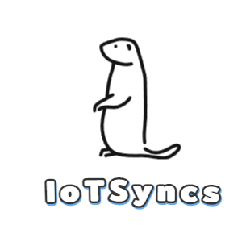

	
    

        <h1>IoTSyncs</h1>
    

    

		
        
	    
	    
		
		
		
	

## 平台简介

* 基于go开发的物联网联网基础平台
* 基于HotGO 2、Go Frame 2、Vue3、Naive UI、UinApp、Emqx等技术栈开发
* 前端采用Naive-Ui-Admin、Vue、Naive UI、UinApp。

## 演示地址

* [https://demo.iotsyncs.com](https://demo.iotsyncs.com)

> 账号：admin  密码：123456

## 特征

* **开箱即用：** 使用docker-compose快速部署后即可快速体验物联网基础平台。
* **多应用入口：** 多入口分为 Admin (后台)、Home (前台页面)、Api (对外通用接口)、不同的业务，进入不同的应用入口。
* **丰富的权限管理：** 系统沿用HotGo的菜单权限管理，以及设备级的细致权限控制
* **高可用的设备接入：** 采用了Emqx的设备接入方案，轻松接入十万级别的设备接入，采用mqtt协议接入平台保证数据传输稳定性
* **规则引擎：** 支持复杂的规则引擎进行数据转发，支持延迟发送、规则发送、数据重发等规则
* **丰富的物模型：** 平台默认存有大量的物模型数据，新增产品时无需重新填写参数

## 重要功能规划

1. 权限管理：对系统菜单权限进行管理
2. 物模型管理：平台维护的物模型数据，方便产品调用
3. 产品管理：产品是某类物联网设备的抽象，用于定于具体的设备属性和事件等
4. 设备管理：实体设备的具体承载，用于存放物理设备的数据和事件通知
5. 规则引擎：用于对设备数据的转发，设定相应规则后就能转发到第三方应用上
6. 客户端SDK：用于采集设备数据发送到平台上(规划中...)

## 感谢(排名不分先后)

> hotgo [https://github.com/bufanyun/hotgo](https://github.com/bufanyun/hotgo)
>
> gf框架 [https://github.com/gogf/gf](https://github.com/gogf/gf)
>
> naive-ui [https://www.naiveui.com](https://www.naiveui.com)
>
> naive-ui-admin [https://github.com/jekip/naive-ui-admin](https://github.com/jekip/naive-ui-admin)
>
> websocket [https://github.com/gorilla/websocket](github.com/gorilla/websocket)
> 
> casbin [https://github.com/casbin/casbin](https://github.com/casbin/casbin)
>
> gopay [https://github.com/go-pay/gopay](https://github.com/go-pay/gopay)
>
> emqx [https://github.com/emqx/emqx](https://github.com/emqx/emqx)

## 交流QQ群

交流群①：826069588 

> 感谢你使用IoTSyncs，团队精力时间有限，因此我们不再提供免费的技术服务！
>
> 同时您也可以联系我们，雇佣我们团队为您干活，谢谢合作！

## 商用说明

> IoTSyncs 是开源免费的，遵循 MIT 开源协议，意味着您无需支付任何费用，也无需授权，即可将它应用到您的产品中。

* 使用本项目必须保留所有版权信息。

* 本项目包含的第三方源码和二进制文件之版权信息另行标注。

* 版权所有Copyright © 2020-2023 by Ms (https://github.com/mijjjj/iotsyncs)
All rights reserved。

## 免责声明

* IoTSyncs为开源学习项目，一切商业行为与IoTSyncs无关。

* 用户不得利用IoTSyncs从事非法行为，用户应当合法合规的使用，发现用户在使用产品时有任何的非法行为，IoTSyncs有权配合有关机关进行调查或向政府部门举报，IoTSyncs不承担用户因非法行为造成的任何法律责任，一切法律责任由用户自行承担，如因用户使用造成第三方损害的，用户应当依法予以赔偿。

* 所有与使用IoTSyncs相关的资源直接风险均由用户承担。

#### 如果对您有帮助，您可以点右上角 💘Star💘支持

## License

[MIT © IoTSyncs-2023](./LICENSE)